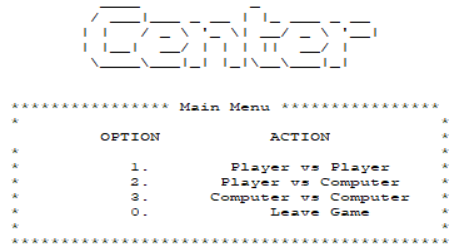

# Programação Funcional e Lógica 2022/2023
## Trabalho Prático 2
O jogo realizado pelo nosso grupo no 2º trabalho prático no âmbito da unidade curricula Programação Funcional e Lógica foi o "Center".

- Grupo: Center_5
- Participantes: 
  - up202004656 - Mariana Solange Mariana Rocha (contribuição: 50%)
  - up202007928 - Matilde Maria Amaral Silva    (contribuição: 50%)
  
## Instalação e Execução
### 🐧 Execução do jogo em Linux 
Para a correta execução do programa é necesário ter o SICStus 4.7.1 ou uma versão mais recente.

Para correr o programa, é então necessário importar o ficheiro `main.pl`. Isto pode-se fazer na linha de comandos:
```
  ?- [main].
  ```
  
### 🪟 Execução do jogo em Windows 
Para a correta execução do programa é necessário ter o SICStus Prolog 4.7.1 ou uma versão mais recente.

Os passos para efetuar a execução:
- abrir o interpretador do SICStus;
- consultar (`File` no canto superior direito -> `Consult` -> escolher o ficheiro) o ficheiro `main.pl`;
- após isso, correr no SICStus `play.`;
- finalmente, podemos utilizar o programa.
  
## Descrição do Jogo
### ♟️ Tabuleiro
O tabuleiro do jogo pode ter formato hexagonal ou quadrangular. A lateral do tabuleiro hexagonal tanto pode ter número ímpar como par de casas. Já se se optar pelo tabuleiro quadrangular número de filas deve ser ímpar, de modo a que o tabuleiro tenha centro. Por questões de simplicidade, optamos pelo tabuleiro quadrangular.
### 🎯 Gameplay
Os jogadores podem jogar com as peças pretas ou com as brancas.
Para efetuar uma jogada é necessário:
-  que o **número de peças visíveis** numa determinada posição (em qualquer uma das 8 direções) seja **igual ou superior** à distância que a peça se encontra à borda do tabuleiro;
-  essas peças têm de ser da mesma cor da peça em questão.
  
🏆 O vencedor é o primeiro jogador a conseguir colocar uma peça no centro do tabuleiro.

## Lógica do Jogo
### Representação interna do estado do jogo
O estado do jogo é composto por:
- o estado atual do tabuleiro:
  - este é representado por uma **lista de listas** em que cada lista representa uma linha no tabuleiro e cada posição da lista representa um quadrado do tabuleiro. Cada quadrado do tabuleiro não tem diferença em cor, visto que não tem relevância para o jogo.
- cada jogador é definido pelo uso dos caracteres `x` e `o`, sendo `x` o `Player 1`, podendo ser considerada a peça branca, e `o` o `Player 2`, a peça preta.

### Estado Inicial (5x5)
```
[
    [' ', ' ', ' ', ' ', ' '],
    [' ', ' ', ' ', ' ', ' '],
    [' ', ' ', ' ', ' ', ' '],
    [' ', ' ', ' ', ' ', ' '],
    [' ', ' ', ' ', ' ', ' ']
] 
```


### Estado Intermédio (5x5)
```
[
    ['x', 'o', 'o', ' ', ' '],
    [' ', 'x', ' ', ' ', ' '],
    [' ', ' ', ' ', ' ', ' '],
    [' ', ' ', ' ', ' ', ' '],
    [' ', ' ', ' ', ' ', ' ']
] 
```


### Estado Final (5x5)
```
[
    ['x', 'o', 'o', ' ', ' '],
    [' ', 'x', 'o', ' ', ' '],
    [' ', ' ', 'x', 'o', ' '],
    [' ', 'x', ' ', ' ', ' '],
    [' ', ' ', 'x', ' ', ' ']
] 
```


### Visualização do estado do jogo

Após o ínicio do jogo, correndo o predicado `play.` é apresentado ao jogador um menu com as seguintes opções:



Para escolher uma opção, tudo o que o jogador tem de fazer é escrever o número relativo à opção seguido de um ponto final e premir `Enter`.
As opções `1`, `2` e `3` correspoondem ao modos de jogo disponíveis:
```
1 - Player vs Player
2 - Player vs Computer
3 - Computer vs Computer
```
Após a seleção de qualquer uma dessas três opções é apresentado um ecrã para escolher o tamanho do lado do tabuleiro, sendo este arbitrário e sem limite superior desde que seja um número ímpar. 
Quanto maior o tamanho escolhido, mais tempo demorará o jogo.

Para a opção `1 - Player vs Player`:
Após a seleção do tamanho do tabuleiro, dá-se início ao jogo. O primeiro a jogar é o `Player 1`, seguido do `Player 2`, repetidamente, até ao fim do jogo.

Já para a opção `2 - Player vs Computer`:
Após a escolha do tamanho do tabuleiro, escolhe-se o nível de dificuldade do oponente:
  - Nível 1: o computador escolhe uma jogada aleaória;
  - Nível 2: o computador escolhe a melhor jogada.
Novamente, o `Player 1` é quem joga a primeira jogada (sendo o `Player 1` o jogador, e o `Player 2` o computador), seguido do `Player 2`, mantendo-se este ciclo até ao término da partida.

Na opção `3 - Computer vs Computer`:
Após a escolha do tamanho do tabuleiro, escolhe-se o modo de jogo dos dois computadores:
  - Nível 1: ambos os computadores escolhem uma jogada aleaória;
  - Nível 2: ambos os computadores escolhem a melhor jogada.

Ao iniciar um jogo, é apresentado um tabuleiro, com a medida escolhida. E conforme seja a vez do jogador ou do computador, apresenta um diálogo a pedir input do jogador ou um diálogo com a jogada efetuada pelo computador.

A visualização do estado do jogo foi implementada fazendo uso do predicado `display_game(+GameState)`, que dá _display_ ao estado atual do tabuleiro, recorrendo também ao predicado `drawBoard`, que recebe o estado atual do tabuleiro e desenha todo o tabuleiro.

```prolog
display_game(GameState) :-
    boardSize(BoardSize),
    Size is 3*BoardSize+BoardSize-1,
    nl, writeColumnNumbers(1), nl,
    write(' '),
    writeCharNTimes(Size, '_'), nl,
    drawBoard(GameState, 1), !.
```
Também é feito uso do predicado `initial_state`, que ao receber o tamanho do tabuleiro devolve o estado inicial do jogo.
```prolog
initial_state(Size, GameState) :-
    \+ divisible(Size, 2),
    retractall(boardSize(_)),
    assert(boardSize(Size)),
    getGameState(Size, GameState, [], Size), !.
```

### Processo de execução de uma jogada
O processo de execução de uma jogada é feita através dos predicados `move` e `valid_moves`.
O predicado `valid_moves` recebe a lista das jogadas válidas de uma determinada posição para um determinado tipo de peça, e está explicado o seu funcionamento mais abaixo na secção "Lista das jogadas válidas".

Já o predicado `move` coloca a peça do jogador na posição definida em Move, guardando valores importantes como o do estado do novo tabuleiro, a posição onde foi inserida a peça no novo estado do tabuleiro e o próximo jogador a efetuar uma jogada.

```prolog
move(GameState, Move, NewGameState) :-
    list_nth(Move, 0, Player),
    list_nth(Move, 1, X),
    list_nth(Move, 2, Y),
    placeStone(GameState, Player, X, Y, NewGameState).
```

### Game Over
A estratégia utilizada para verificar se o jogo chegou ao fim está implementada através do predicado `game_over` que verifica se alguma peça está no centro do tabuleiro, se estiver o jogo acabou e a cor dessa peça sai vencedora da partida.

```prolog
game_over(GameState, Winner) :-
    boardSize(BoardSize),
    D is div(BoardSize, 2),
    list_nth(GameState, D, Row),
    list_nth(Row, D, Winner),
    Winner \= ' ',
    Winner \= " ".
```

### Lista das jogadas válidas
A lista de jogadas válidas está implementada no predicado `valid_moves`. Este chama `getListOfMoves` que recebe o estado do jogo (GameState) e o atual jogador. Verifica que coordenadas são válidas para a inserção de uma nova peça percorrendo todas as células do tabuleiro. Para a verificação da validade das jogadas usa o predicado `legalStonePlacement`. 
No fim de percorrer, `getListOfMoves` junta todas as possíveis jogadas em `ListOfMoves` (uma jogada tem a estrutura [Player, X, Y]) e manda para `valid_moves`. Abaixo o código:


```prolog
legalStonePlacement(GameState, X, Y, Player) :-
    X2 is X-1,
    Y2 is Y-1,
    list_nth(GameState, Y2, Row),
    list_nth(Row, X2, Elem),
    (Elem = ' ' ; Elem = " "),
    howManyFriendsInSight(GameState, Player, X, Y, Friends),
    distanceFromPerimeter(X, Y, Distance),
    Distance =< Friends.
 ```

 ```prolog 
getListOfMoves(GameState, Player, X, Y, Aux, ListOfMoves) :-
    
    boardSize(BoardSize),
    X = BoardSize,
    Y =< BoardSize,
    A is 1,
    B is Y+1,
    legalStonePlacement(GameState, X, Y, Player),
    append([], [Player], L1),
    append(L1, [X], L2),
    append(L2, [Y], Move),
    append(Aux, [Move], L3),
    getListOfMoves(GameState, Player, A, B, L3, ListOfMoves) ;

    boardSize(BoardSize),
    Y =< BoardSize,
    X \= BoardSize,
    A is X+1,
    B is Y,
    legalStonePlacement(GameState, X, Y, Player), !,
    append([], [Player], L1),
    append(L1, [X], L2),
    append(L2, [Y], Move),
    append(Aux, [Move], L3),
    getListOfMoves(GameState, Player, A, B, L3, ListOfMoves), ! ;
    
    
    boardSize(BoardSize),
    Y =< BoardSize,
    X \= BoardSize,
    A is X+1,
    B is Y,
    \+ legalStonePlacement(GameState, X, Y, Player), !,
    getListOfMoves(GameState, Player, A, B, Aux, ListOfMoves), ! ;

    boardSize(BoardSize),
    Y =< BoardSize,
    X = BoardSize,
    A is 1,
    B is Y+1,
    \+ legalStonePlacement(GameState, X, Y, Player), !,
    getListOfMoves(GameState, Player, A, B, Aux, ListOfMoves), ! .

getListOfMoves(_, _, X, Y, Aux, Aux) :-
    boardSize(BoardSize),
    K is BoardSize+1,
    X = 1,
    Y = K.
 ```

 ```prolog
 valid_moves(GameState, Player, ListOfMoves) :-
    getListOfMoves(GameState, Player, 1, 1, [], ListOfMoves).
 ```

### Avaliação do tabuleiro
A estratégia utilizada para avaliar o estado do tabuleiro foi implementada pelo predicado `value(+GameState, +Player, -Value)` que retorna o número de peças de `Player` que ainda faltam estar à vista do centro para que este possa vencer o jogo. Quanto mais pequeno o valor deste, mais próximo estará o jogador de uma possível vitória.

```prolog
value(GameState, Player, Value) :-
    boardSize(BoardSize),
    Middle is div(BoardSize, 2)+1,
    howManyFriendsInSight(GameState, Player, Middle, Middle, Answer),
    distanceFromPerimeter(Middle, Middle, Distance),
    Value is Distance-Answer.
```
O predicado `distanceFromPerimeter`, usado em `value`, calcula a distância mais curta desde as coordenadas dadas até ao perímetro do tabuleiro.

```prolog
distanceFromPerimeter(X, Y, Distance) :-
    
    getHorizontalDistance(X, HorizontalDistance),
    getVerticalDistance(Y, VerticalDistance),
    VerticalDistance =< HorizontalDistance,
    Distance is VerticalDistance ;

    getHorizontalDistance(X, HorizontalDistance),
    getVerticalDistance(Y, VerticalDistance),
    VerticalDistance > HorizontalDistance,
    Distance is HorizontalDistance.
``` 

Já o predicado `howManyFriendsInSight`, também usado no predicado `value`, recebe o estado do tabuleiro e as coordenadas da posição e calcula os amigos que estão visíveis daí.
```prolog
howManyFriendsInSight(GameState, Player, X, Y, Answer) :-
    Y2 is Y-1,
    list_nth(GameState, Y2, Row),
    X2 is X-1,
    howManyFriendsInRow(Row, Player, X2, 0, 0, AnswerRow),
    howManyFriendsInColumn(GameState, Player, X2, Y2, 0, 0, AnswerColumn),
    howManyFriendsInLeftDiagonal(GameState, Player, X2, Y2, AnswerLeftDiagonal),
    howManyFriendsInRightDiagonal(GameState, Player, X2, Y2, AnswerRightDiagonal),
    Answer is (AnswerRow + AnswerColumn + AnswerLeftDiagonal + AnswerRightDiagonal).
```

### Jogadas do Computador
As jogadas do computador têm dois níveis:
  - Nível 1: O predicado `choose_move` recebe `valid_moves` (todas as jogadas válidas num certo estado de jogo)  e, neste caso, escolhe, aleatoriamente, um número entre 0 e o tamanho de `valid_moves`-1 (ou seja, um índice dentro da lista de todas as jogadas válidas). A jogada é escolhida então de acordo então com o índice gerado aleatoriamente.

  - Nível 2: O predicado `choose_move` recebe `valid_moves` e, neste caso, é usado o algoritmo minimax. O mesmo foi implementado do seguinte modo: para simular as folhas de uma árvore binária, selecionam-se duas das jogadas possíveis de cada vez (2 elementos de `ListOfMoves`), é comparado o `Value` das duas de acordo com o argumento `Criteria`, portanto só uma de duas jogadas é selecionada. Repete-se esta estratégia de seleção de pares, cortando, assim, a `ListOfMoves` a metade em cada iteração do algoritmo. Este processo continua até `ListOfMoves` ter apenas 1 elemento, que será unificado com `BestMove`.
  De notar, `Criteria` varia entre cada iteração do algoritmo para que seja feita, alternadamente, uma comparação que valoriza o maior ou menor `Value`. Foi também imposta a restrição que a última comparação deve ser a escolher o mínimo `Value`.

O predicado `minimax` implementado:

```prolog
minimax(ListOfMoves, ListOfScores, Criteria, BestMove) :-
    ((Criteria = 0, NewCriteria is 1) ; (Criteria = 1, NewCriteria is 0)),
    length(ListOfMoves, L),
    L \= 1,
    evaluateInTwos(ListOfMoves, ListOfScores, ReducedMoves, ReducedScores, Criteria),
    minimax(ReducedMoves, ReducedScores, NewCriteria, BestMove).

minimax([Move|[]], ListOfScores, _, Move) :-
    length(ListOfScores, L),
    L = 1.
```

O predicado `evaluateInTwos` que, como referido, avalia dois elementos de `ListOfMoves` de cada vez. Se `ListOfMoves` tiver um número ímpar de elementos então o último elemento não é comparado e é mantido na lista.

```prolog
evaluateInTwos([], [], [], [], _).

evaluateInTwos([M|[]], [S|[]], [M|[]], [S|[]], _).

evaluateInTwos([M1, M2 | ListOfMoves], [S1, S2 | ListOfScores], [MoveOption | ReducedMoves], [ScoreOption | ReducedScores], Criteria) :-
    ((Criteria = 0,
    (
        S1 >= S2,
        ScoreOption is S1,
        clone(M1, MoveOption) ;

        S2 > S1,
        ScoreOption is S2,
        clone(M2, MoveOption)
    )) ;

    (Criteria = 1,
    (
        S1 =< S2,
        ScoreOption is S1,
        clone(M1, MoveOption) ;

        S2 < S1,
        ScoreOption is S2,
        clone(M2, MoveOption)
    )
    )),
    evaluateInTwos(ListOfMoves, ListOfScores, ReducedMoves, ReducedScores, Criteria).

```

## Conclusão
Consideramos que conseguimos implementar com sucesso o jogo _Center_ usando a línguagem _Prolog 4.7._

### Dificuldades
- Implementação do algoritmo minimax, um algoritmo direcionado a árvores binárias, que teve de ser adaptado para funcionar com listas.

### Melhorias
- Implementação do _alpha beta pruning_ no minimax;
- Verificação da jogada a várias profundidades de jogo.


## Fontes
- https://boardgamegeek.com/boardgame/360905/center
  
