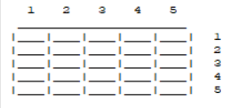
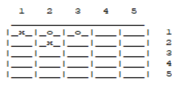
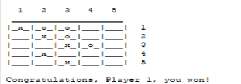

# Programação Funcional e Lógica 2022/2023
## Trabalho Prático 2
O jogo realizado pelo nosso grupo no 2º trabalho prático no âmbito da unidade curricula Programação Funcional e Lógica foi o "Center".

- Grupo: Center_5
- Participantes: 
  - up202004656 - Mariana Solange Mariana Rocha (contribuiçao%)
  - up202007928 - Matilde Maria Amaral Silva    (contribuição%)
  
## Instalação e Execução
### 🐧 Execução do jogo em Linux 
Para a correta execução do programa é necesário ter o SICStus 4.7.1 ou uma versão mais recente.

Para correr o programa, é então necessário consultar o ficheiro `main.pl`. Isto pode-se fazer na linha de comandos:
```
  ?- consult('./play.pl').
  ```
  
### 🪟 Execução do jogo em Windows 
Para a correta execução do programa é necessário ter o SICStus Prolog 4.7.1 ou uma versão mais recente.

Os passos para efetuar a execução:
- abrir o interpretador do SICStus;
- consultar (`File` no canto superior direito -> `Consult` -> escolher o ficheiro) o ficheiro `main.pl`;
- após isso, correr no SICStus `play.`;
- finalmente, podemos utilizar o programa.
  
## Descrição do Jogo
### ♟️ Tabuleiro
O tabuleiro do jogo pode ter formato hexagonal ou quadrangular. A lateral do tabuleiro hexagonal tanto pode ter número ímpar como par de casas. Já se se optar pelo tabuleiro quadrangular número de filas deve ser ímpar, de modo a que o tabuleiro tenha centro. Por questões de simplicidade, optamos pelo tabuleiro 
### 🎯 Gameplay
Os jogadores podem jogar com as peças pretas ou com as brancas.
Para efetuar uma jogada é necessário:
-  que o **número de peças visíveis** numa determinada posição (em qualquer uma das 8 direções) seja **igual ou superior** à distância que a peça se encontra à borda do tabuleiro;
-  essas peças têm de ser da mesma cor da peça em questão.
  
🏆 O vencedor é o primeiro jogador a conseguir colocar uma peça no centro do tabuleiro.

## Lógica do Jogo
### Representação interna do estado do jogo
O estado do jogo é composto por:
- o estado atual do tabuleiro:
  - este é representado por uma **lista de listas** em que cada lista representa uma linha no tabuleiro e cada posição da lista representa um quadrado do tabuleiro. Cada quadrado do tabuleiro não tem diferença em cor, visto que não tem relevância para o jogo.
- a cor do jogador atual:
  - é definida pelo uso dos caracteres `x` e `o`, sendo `x` branco e `o` preto.

### Estado Inicial (5x5)
```
[
    [' ', ' ', ' ', ' ', ' '],
    [' ', ' ', ' ', ' ', ' '],
    [' ', ' ', ' ', ' ', ' '],
    [' ', ' ', ' ', ' ', ' '],
    [' ', ' ', ' ', ' ', ' ']
] 
```


### Estado Intermédio (5x5)
```
[
    ['x', 'o', 'o', ' ', ' '],
    [' ', 'x', ' ', ' ', ' '],
    [' ', ' ', ' ', ' ', ' '],
    [' ', ' ', ' ', ' ', ' '],
    [' ', ' ', ' ', ' ', ' ']
] 
```


### Estado Final (5x5)
```
[
    ['x', 'o', 'o', ' ', ' '],
    [' ', 'x', 'o', ' ', ' '],
    [' ', ' ', 'x', 'o', ' '],
    [' ', 'x', ' ', ' ', ' '],
    [' ', ' ', 'x', ' ', ' ']
] 
```


### Visualização do Estado do jogo
`TO-DO`

### Processo de execução de uma jogada
`TO-DO`

### Game Over
A estratégia utilizada para verificar se o jogo chegou ao fim está implementada através do predicado `game_over` que verifica se alguma peça está no centro do tabuleiro, se estiver o jogo acabou e a cor dessa peça sai vencedora da partida.

```prolog
game_over(GameState, Winner) :-
    boardSize(BoardSize),
    D is div(BoardSize, 2),
    list_nth(GameState, D, Row),
    list_nth(Row, D, Winner),
    Winner \= ' ',
    Winner \= " ".
```

### Lista das jogadas válidas
A lista de jogadas válidas está implementada no predicado ``getListOfMoves`.  Esta recebe o estado do jogo (GameState) e o atual jogador. Verifica que coordenadas são válidas para a inserção de uma nova peça percorrendo todas as células do tabuleiro. Para a verificação da validade das jogadas usa o predicado `legalStonePlacement`. 
No fim de percorrer, junta todas as possíveis jogadas em `ListOfMoves` (uma jogada tem a estrutura [Player, X, Y]).


```prolog
legalStonePlacement(GameState, X, Y, Player) :-
    X2 is X-1,
    Y2 is Y-1,
    list_nth(GameState, Y2, Row),
    list_nth(Row, X2, Elem),
    (Elem = ' ' ; Elem = " "),
    howManyFriendsInSight(GameState, Player, X, Y, Friends),
    distanceFromPerimeter(X, Y, Distance),
    Distance =< Friends.
 ```

 ```prolog 
getListOfMoves(GameState, Player, X, Y, Aux, ListOfMoves) :-
    
    boardSize(BoardSize),
    X = BoardSize,
    Y =< BoardSize,
    A is 1,
    B is Y+1,
    legalStonePlacement(GameState, X, Y, Player),
    append([], [Player], L1),
    append(L1, [X], L2),
    append(L2, [Y], Move),
    append(Aux, [Move], L3),
    getListOfMoves(GameState, Player, A, B, L3, ListOfMoves) ;

    boardSize(BoardSize),
    Y =< BoardSize,
    X \= BoardSize,
    A is X+1,
    B is Y,
    legalStonePlacement(GameState, X, Y, Player), !,
    append([], [Player], L1),
    append(L1, [X], L2),
    append(L2, [Y], Move),
    append(Aux, [Move], L3),
    getListOfMoves(GameState, Player, A, B, L3, ListOfMoves), ! ;
    
    
    boardSize(BoardSize),
    Y =< BoardSize,
    X \= BoardSize,
    A is X+1,
    B is Y,
    \+ legalStonePlacement(GameState, X, Y, Player), !,
    getListOfMoves(GameState, Player, A, B, Aux, ListOfMoves), ! ;

    boardSize(BoardSize),
    Y =< BoardSize,
    X = BoardSize,
    A is 1,
    B is Y+1,
    \+ legalStonePlacement(GameState, X, Y, Player), !,
    getListOfMoves(GameState, Player, A, B, Aux, ListOfMoves), ! .

getListOfMoves(_, _, X, Y, Aux, Aux) :-
    boardSize(BoardSize),
    K is BoardSize+1,
    X = 1,
    Y = K.
 ```

### Avaliação do estado do jogo
`TO-DO`

### Jogadas do Computador
`TO-DO`

## Conclusão
### `TO-DO`

## Fontes
- https://boardgamegeek.com/boardgame/360905/center
  